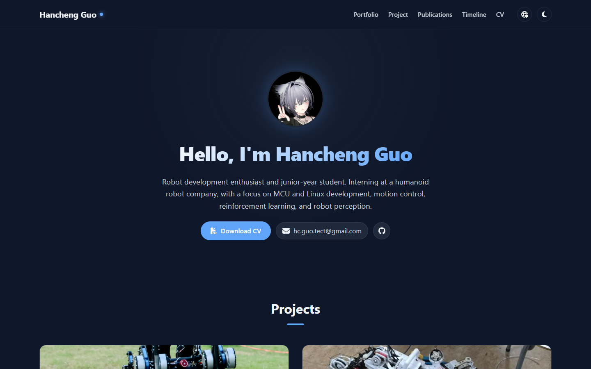
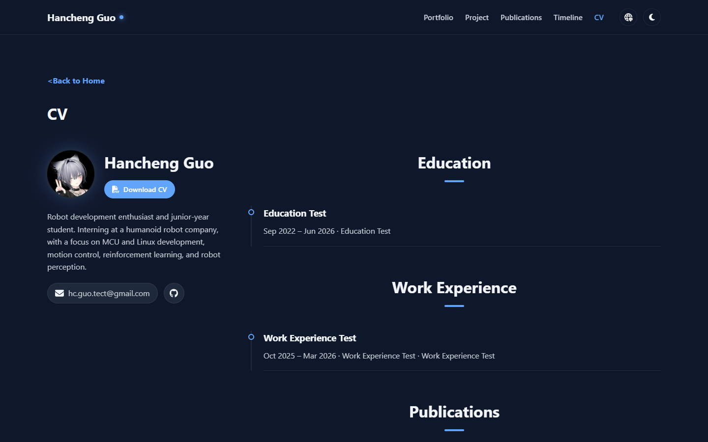
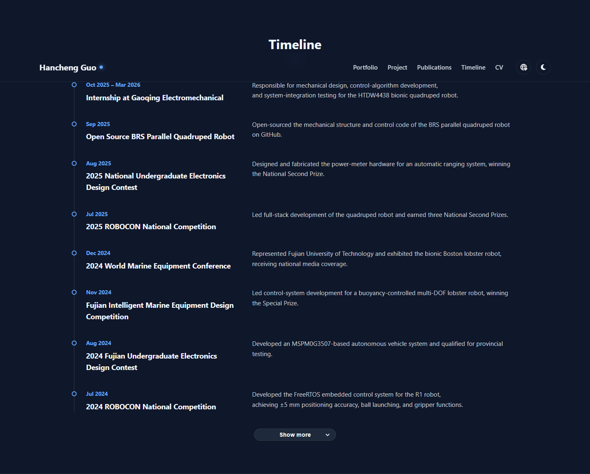
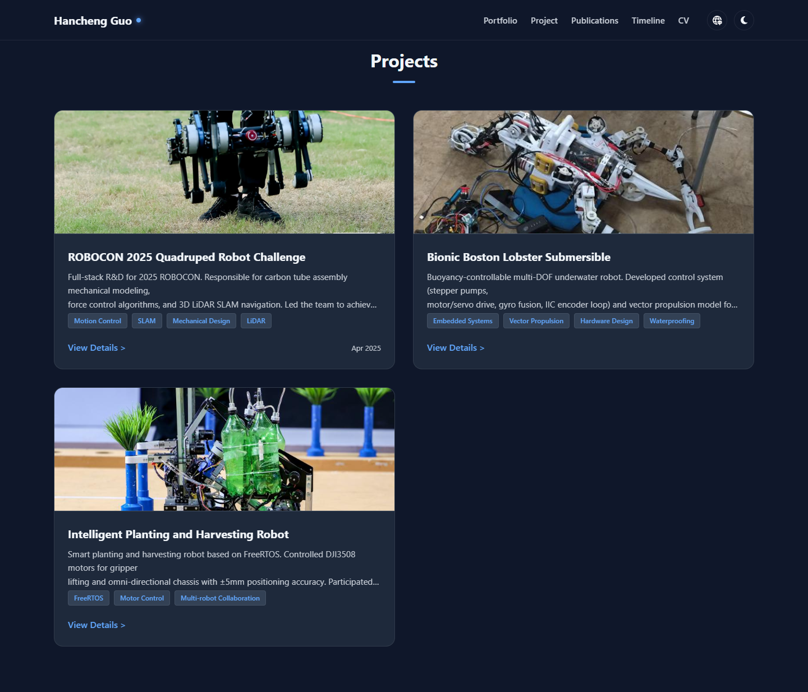

# Portfolio Python 工具手册

本文档说明如何通过根目录的 `portfolio.py` 配置并生成网站。内容按功能类别组织，可以从头阅读，也可以作为 API 速查手册使用。

## 1. 工作模型

```text
编辑 portfolio.py
        ↓
validate：检查字段、日期、URL 和本地资源
        ↓
build：生成完整 HTML 与 JSON
        ↓
preview：启动本地静态服务器
        ↓
提交生成结果并部署
```

日常维护只编辑 `portfolio.py` 和 `assets/` 中的资源。以下文件由 Python 生成，不应手工维护：

- `index.html`
- `pages/cv.html`
- `pages/projects/*.html`
- `assets/data/site.json`
- `assets/data/projects.json`



## 2. 命令行

所有命令都在项目根目录执行。

### 校验

```bash
python portfolio.py validate
```

只检查内容，不覆盖网页。它会检查项目字段、ID、日期格式、URL 协议、本地图片和 favicon 路径。

### 构建

```bash
python portfolio.py build
```

校验通过后生成首页、CV、项目详情页和两份 JSON。相同输入会生成稳定、格式化的 UTF-8 文件。

### 预览

```bash
python portfolio.py preview
python portfolio.py preview --port 8080
```

`preview` 会先构建，再监听 `127.0.0.1`。默认端口是 `8000`，按 `Ctrl+C` 停止。

### 清理

```bash
python portfolio.py clean
```

`clean` 只删除带生成标记的 HTML 和两份生成 JSON；不会删除 `portfolio.py`、构建器、图片、图标或 PDF。再次运行 `build` 即可恢复。

## 3. 通用数据格式

### 双语文字

访客可见文字建议统一使用 `dict(zh=..., en=...)`：

```python
title=dict(
    zh="四足机器人",
    en="Quadruped Robot",
)
```

构建器也接受单个字符串，并将其用于两种语言；正式内容仍建议明确填写中英文。

### 长文本

长文本使用括号内的相邻字符串。Python 会自动拼接它们：

```python
summary=dict(
    zh=(
        "第一行内容。\n"
        "第二行内容。\n\n"
        "新的段落。"
    ),
    en=(
        "The first line.\n"
        "The second line.\n\n"
        "A new paragraph."
    ),
)
```

### Markdown

所有自定义显示文字都按 Markdown 解析，包括标题、摘要、venue、履历字段、链接按钮和项目正文。

```text
**粗体**
*斜体*
_下划线_
[链接文字](https://example.com)
```

本项目将 `_文字_` 扩展为下划线；斜体请使用 `*文字*`。邮箱、URL、日期、文件路径、项目 ID 和图标名是结构化字段，不按 Markdown 解析。

### 日期

单月使用：

```python
date="2026-03"
```

时间段使用：

```python
date=dict(
    start="2025-10",
    end="2026-03",
)
```

月份格式必须是 `YYYY-MM`，且结束月份不能早于开始月份。`last_update_date` 使用 `YYYY-MM-DD`。Education、Work Experience、Awards 和 Timeline 必须提供日期；Publication 与 Project 日期可省略。

## 4. Portfolio 站点配置

根目录必须暴露名为 `portfolio` 的 `Portfolio` 实例：

```python
from portfolio_content import Portfolio


portfolio = Portfolio(
    site_name=dict(
        zh="郭瀚丞 个人主页",
        en="Hancheng Guo Homepage",
    ),
    author=dict(
        zh="郭瀚丞",
        en="Hancheng Guo",
    ),
    copyright_text=dict(
        zh="保留所有权利。",
        en="All rights reserved.",
    ),
    last_update_date="2026-09-07",
    # favicon="assets/images/favicon.png",
)
```

| 参数 | 用途 |
|---|---|
| `site_name` | 页面标题、SEO 标题和站点名称 |
| `author` | 左上角品牌文字和页脚作者 |
| `copyright_text` | 页脚版权补充文字，支持 Markdown |
| `last_update_date` | 页脚更新时间，格式为 `YYYY-MM-DD` |
| `favicon` | 可选的本地文件或 HTTPS URL；省略时不生成标签页图标 |

页脚第一行格式是 `© {year} {author}, {copyright_text}`；`copyright_text` 为空时不会保留多余逗号。

## 5. Profile 与联系方式

### `set_profile()`

首页 Portfolio 和 CV 左侧栏读取同一个 profile：

```python
portfolio.set_profile(
    name=dict(
        zh="郭瀚丞",
        en="Hancheng Guo",
    ),
    summary=dict(
        zh=(
            "机器人开发爱好者，专注于运动控制与机器人感知。"
        ),
        en=(
            "Robotics developer focused on motion control and perception."
        ),
    ),
    avatar="assets/images/Avatar.jpg",
    hero_background="assets/images/Portfolio-01-3.png",
    email="name@example.com",
    location=dict(
        zh="中国",
        en="China",
    ),
)
```

常用字段为 `name`、`summary`、`email` 和可选的 `location`。邮箱会生成 `mailto:` 链接。

`avatar` 和 `hero_background` 是可选的图片路径：`avatar` 同时用于首页头像和 CV 头像；`hero_background` 仅用于首页 Portfolio 顶部的横幅背景。两者都必须显式传入才会显示，省略后不会输出图片、空占位或默认图片；`avatar=None` 或 `hero_background=None` 可移除先前的配置。图片路径会在 `validate`/`build` 时按本地资源规则校验。

### `add_contact()`

每次调用增加一个联系方式。当前项目内置并实际使用的社交图标是 `github`。

```python
portfolio.add_contact(
    label=dict(
        zh="代码仓库",
        en="GitHub",
    ),
    icon="github",
    url="https://github.com/example",
)
```

首页和 CV 会复用同一组联系方式。

## 6. CV 与履历

Education、Work Experience、Tech Stack 与 Awards & Scholarships 只显示在 CV 页面。Publications 同时显示在首页和 CV。



### `add_education()`

```python
portfolio.add_education(
    date=dict(
        start="2022-09",
        end="2026-06",
    ),
    institution=dict(
        zh="示例大学",
        en="Example University",
    ),
    degree=dict(
        zh="机器人工程学士",
        en="B.Eng. in Robotics",
    ),
)
```

### `add_work_experience()`

```python
portfolio.add_work_experience(
    date=dict(
        start="2025-10",
        end="2026-03",
    ),
    title=dict(
        zh="机器人工程实习生",
        en="Robotics Engineering Intern",
    ),
    organization=dict(
        zh="示例公司",
        en="Example Company",
    ),
    summary=dict(
        zh=(
            "负责控制算法开发与系统集成测试。"
        ),
        en=(
            "Developed control algorithms and performed system integration tests."
        ),
    ),
)
```

### `add_publication()`

`publication_type` 只能是 `journal` 或 `conference`。`date` 可省略；省略时页面不会显示日期或多余分隔符。

```python
portfolio.add_publication(
    publication_type="journal",
    date="2025-08",
    title=dict(
        zh="[论文标题](https://example.com/paper)",
        en="[Paper Title](https://example.com/paper)",
    ),
    venue=dict(
        zh="**作者姓名**，*期刊名称*。",
        en="**Author Name**, *Journal Name*.",
    ),
)
```

### `add_award()`

```python
portfolio.add_award(
    date="2025-08",
    title=dict(
        zh="全国二等奖",
        en="National Second Prize",
    ),
)
```

### `add_tech_group()`

每次调用增加一个 Tech Stack 分类。目前该模块只显示在 CV。

```python
portfolio.add_tech_group(
    title=dict(
        zh="机器人技术",
        en="Robotics",
    ),
    items=[
        dict(
            name=dict(
                zh="运动控制",
                en="Motion Control",
            ),
        ),
        dict(
            name=dict(
                zh="强化学习",
                en="Reinforcement Learning",
            ),
        ),
    ],
)
```

### `set_resume()`

```python
portfolio.set_resume(
    label=dict(
        zh="下载简历",
        en="Download CV",
    ),
    url=dict(
        zh="assets/documents/resume-zh.pdf",
        en="assets/documents/resume-en.pdf",
    ),
)
```

PDF 应先放入 `assets/documents/`。未配置当前语言 URL 时，不生成对应下载按钮。

## 7. Timeline

首页 Timeline 默认展示最新八项，其余内容通过 Show more 按钮展开。



```python
portfolio.add_timeline_event(
    date="2025-09",
    title=dict(
        zh="开源四足机器人",
        en="Open-sourced a Quadruped Robot",
    ),
    description=dict(
        zh=(
            "发布机械结构、控制代码和使用文档。"
        ),
        en=(
            "Released the mechanical design, control code, and documentation."
        ),
    ),
)
```

条目按添加顺序保存，并在页面中以最新内容优先的方式显示。

## 8. Projects



### 新建项目

`add_project()` 返回一个 `Project` 对象。`project_id` 通常省略，构建器会依次分配 `project1`、`project2` 等 ID，并自动维护 `pages/projects/<id>.html`。

```python
project = portfolio.add_project(
    title=dict(
        zh="水下巡检机器人",
        en="Underwater Inspection Robot",
    ),
    date=dict(
        start="2026-01",
        end="2026-06",
    ),
    summary=dict(
        zh=(
            "用于水下设施巡检的机器人平台。"
        ),
        en=(
            "A robotic platform for underwater infrastructure inspection."
        ),
    ),
    thumbnail="assets/images/my-project/cover.jpg",
    thumbnail_alt=dict(
        zh="水下机器人原型",
        en="Underwater robot prototype",
    ),
    tags=(
        dict(
            zh="机器人",
            en="Robotics",
        ),
        dict(
            zh="嵌入式系统",
            en="Embedded Systems",
        ),
    ),
    featured=True,
)
```

可用参数：

| 参数 | 必填 | 说明 |
|---|---:|---|
| `title` | 是 | 中英文项目名称 |
| `summary` | 是 | 中英文卡片摘要 |
| `thumbnail` | 是 | 相对项目根目录的封面路径 |
| `project_id` | 否 | 稳定 ID；省略时自动生成 |
| `date` | 否 | 首页卡片右下角显示的项目日期 |
| `tags` | 否 | 项目标签 |
| `thumbnail_alt` | 否 | 封面替代文本；省略时使用标题 |
| `featured` | 否 | 写入项目数据的精选标记 |
| `status` | 否 | 设为 `draft` 时不在首页和项目前后导航中显示；详情页仍生成并带 `noindex` |

自动 ID 与添加顺序有关。若项目 URL 已公开，应显式填写固定的 `project_id`，避免调整项目顺序后 URL 变化。

### 创建详情页

推荐从项目对象创建页面：

```python
page = project.add_page(
    template="minimal",
)
```

每个项目只能调用一次 `add_page()`。模板包括：

- `minimal`：不预置标题，最适合完全自定义；
- `case-study`：预置 Overview、My Role、Challenge、Approach、Results、Evidence；
- `research`：预置 Abstract、Research Question、Method、Experiment、Findings、Limitations；
- `competition`：预置 Objective、Responsibilities、System Design、Results、Awards。

预置标题会先集中写入页面；需要严格控制内容顺序时使用 `minimal`。

## 9. ProjectPage 内容块

内容块按照调用顺序显示，方法均返回当前 `ProjectPage`，因此可以链式调用；为了可读性，示例采用逐条调用。

### 标题

```python
page.add_heading(
    text=dict(
        zh="我的职责",
        en="My Role",
    ),
    level=2,
)
```

`level` 必须在 2 到 6 之间。

### 段落

```python
page.add_paragraph(
    text=dict(
        zh=(
            "说明项目背景、个人职责、方法和结果。"
        ),
        en=(
            "Describe the context, personal role, approach, and outcome."
        ),
    ),
)
```

### 单张图片

```python
page.add_image(
    "assets/images/my-project/result.jpg",
    alt=dict(
        zh="机器人现场测试结果",
        en="Robot field-test result",
    ),
    caption=dict(
        zh="现场测试",
        en="Field test",
    ),
)
```

`alt` 必填；`caption` 可省略。

### 图片组

```python
page.add_gallery(
    images=[
        dict(
            src="assets/images/my-project/front.jpg",
            alt=dict(
                zh="机器人正面",
                en="Front view of the robot",
            ),
        ),
        dict(
            src="assets/images/my-project/side.jpg",
            alt=dict(
                zh="机器人侧面",
                en="Side view of the robot",
            ),
        ),
    ],
    columns="auto",
)
```

### 列表

```python
page.add_list(
    items=[
        dict(
            zh="设计控制器",
            en="Designed the controller",
        ),
        dict(
            zh="完成现场测试",
            en="Completed field tests",
        ),
    ],
    ordered=False,
)
```

### 引用

```python
page.add_quote(
    text=dict(
        zh="一句简短结论。",
        en="A concise conclusion.",
    ),
    source=dict(
        zh="测试报告",
        en="Test report",
    ),
)
```

### 指标

```python
page.add_metrics(
    items=[
        dict(
            label=dict(
                zh="定位精度",
                en="Positioning accuracy",
            ),
            value="±5 mm",
        ),
    ],
)
```

指标应当真实、可验证。

### 视频

```python
page.add_video(
    url="https://example.com/demo.mp4",
    poster="assets/images/my-project/video-cover.jpg",
    title=dict(
        zh="演示视频",
        en="Demo video",
    ),
)
```

视频 URL 必须使用 HTTPS；`poster` 和 `title` 可省略。

## 10. 项目外部链接

链接按钮根据方法选择正确的本地图标。`label` 可省略；省略时使用默认文字。

```python
page.add_github_link(
    url="https://github.com/example/project",
    label=dict(
        zh="**项目源码**",
        en="**Source code**",
    ),
)

page.add_doc_link(
    url="https://example.com/document.pdf",
    label=dict(
        zh="**技术文档**",
        en="**Documentation**",
    ),
)

page.add_bilibili_link(
    url="https://www.bilibili.com/video/example",
    label=dict(
        zh="**演示视频**",
        en="**Demo**",
    ),
)

page.add_youtube_link(
    url="https://www.youtube.com/watch?v=example",
    label=dict(
        zh="**YouTube 视频**",
        en="**YouTube video**",
    ),
)
```

空 URL 不会显示按钮；非空外部 URL 必须使用 HTTPS。

## 11. 修改、删除和草稿

- 修改项目：直接编辑其 `add_project()` 和 `page.add_*()` 调用。
- 删除项目：删除整段项目定义，下一次 `build` 会移除不再存在的生成详情页。
- 临时删除：可以调用 `portfolio.remove_project("project-id")`。
- 草稿：为项目传入 `status="draft"`。草稿不会出现在首页和项目前后导航，但详情页仍会生成并标记为不可索引。

不要为同一项目调用两次 `add_page()`，否则构建器会报错。

## 12. 构建产物与运行时

`build` 同时写入静态 HTML 和 JSON。浏览器中的 JavaScript 会从 JSON 重新同步页面内容，并提供：

- 中英文切换；
- 深浅主题切换；
- 同页平滑滚动和跨页锚点定位；
- Timeline 展开与收起；
- 项目图片灯箱；
- 移动端菜单。

核心英文内容已经写入 HTML，因此 JavaScript 被禁用或尚未加载时不会出现空白页或 “Loading project”。

## 13. 发布前检查

```bash
python portfolio.py validate
python portfolio.py build
python -m unittest discover -s tests/python -v
```

随后人工检查：

1. 首页、CV 和每个项目详情页；
2. 英文与中文；
3. 深色与浅色主题；
4. 桌面和移动端；
5. CV、GitHub、文档与视频链接；
6. 图片 alt、项目返回和前后导航；
7. Timeline 的八项默认显示和展开按钮。

## 14. 常见问题

### 图片或 PDF 不存在

路径必须从项目根目录开始，例如 `assets/images/project/cover.jpg`，并注意 GitHub Pages 区分文件名大小写。

### `Duplicate project id`

两个项目使用了相同 ID。修改其中一个 `project_id`，或让构建器自动分配。

### `already has a page`

同一项目调用了两次 `add_page()`。每个项目只保留一个详情页。

### `Invalid URL`

外部链接需要使用 `https://`。项目链接还允许 `mailto:`，但推荐邮件统一写在 profile。

### 直接双击 HTML 后数据未更新

浏览器可能限制 `file://` 下的数据请求。使用 `python portfolio.py preview`。

### 修改生成 HTML 后被覆盖

这是预期行为。页面结构需要修改 `portfolio_content/static_renderer.py`，内容需要修改 `portfolio.py`，然后重新构建。

### 中文乱码

用 UTF-8 保存 `portfolio.py`，并确认终端和编辑器使用 UTF-8。
